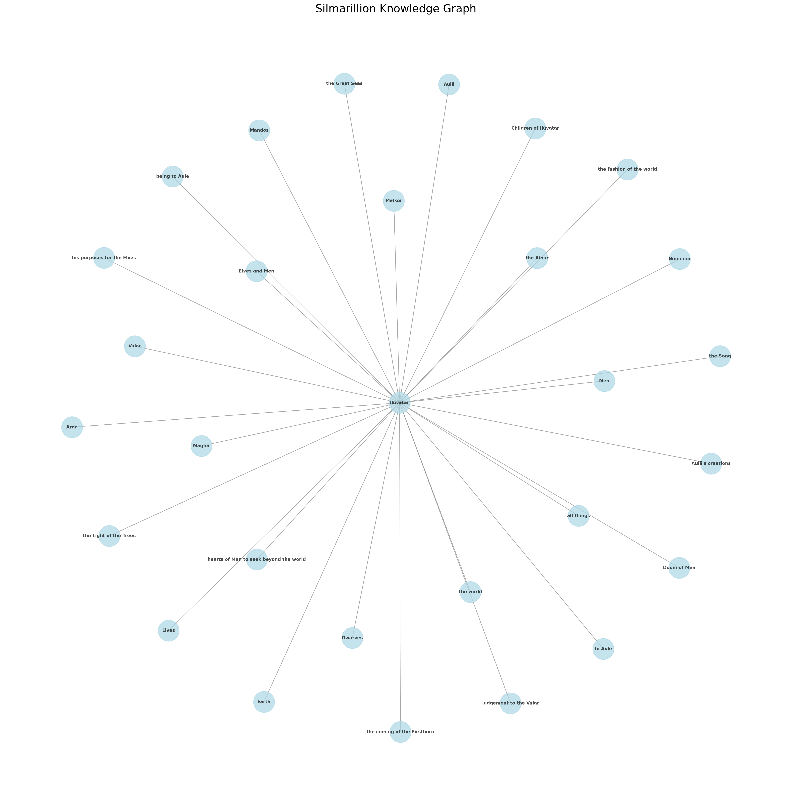

# semanticsilm

Toy application for learning GraphRAG / KnowledgeGraph concepts. Uses the text of The
Silmarillion to generate embeddings, an index, query engine and knowledge graph.

```
export OPENAI_API_KEY='...' # Warning, not cheap!
rye sync
. ./.venv/bin/activate
cd src/semanticsilm
python main.py
```

```
INFO:__main__:Updating index with linked graph store...
INFO:__main__:Final Knowledge Graph structure:
INFO:__main__:Total subjects in graph: 375
INFO:__main__:Total relationships in graph: 4824
Built and saved index

Enter query (or 'quit' to exit): Who are the elves?

The Elves are the First-born Children of Iluvatar, known for their immortality, greater wisdom, skill, and beauty compared to Men. They were initially of like stature and strength as Men
but possessed a deeper understanding and artistry. The Elves who dwelt in Valinor, referred to as Calaquendi, surpassed the Dark Elves in these attributes. They are also characterized by
their connection to the natural world and their enduring legacy in Middle-earth, where they once allied with Men before becoming estranged due to the influence of Morgoth.

Enter query (or 'quit' to exit): Who were the Istari?

The Istari were a group of beings sent by the Lords of the West to contest the power of Sauron and to inspire Elves, Men, and all living things of good will to engage in valiant deeds.
They appeared in the likeness of Men, old but vigorous, and possessed great wisdom and many powers. Among them were notable figures such as Gandalf (Mithrandir), Saruman (Curunir), and Radagast, each with distinct roles and characteristics.

Enter query (or 'quit' to exit): What plagues the world of Arda?

The world of Arda is plagued by the corruption brought about by Melkor, who sought to dominate and subdue both Elves and Men, leading to a growing shadow and turmoil within the realm.
This corruption manifests as a struggle against the natural order and the beauty of creation, resulting in conflict and decay.

Enter query (or 'quit' to exit): What becomes of Melkor?

Melkor, originally one of the Valar, turned to evil purposes and sought dominion over Arda. He fell from his initial splendor due to his arrogance and contempt for all things except himself.
As he descended into darkness, he became a liar and a tyrant, ultimately losing his ability to change form. He sought revenge and plotted with Ungoliant in the dark region of Avathar.
His actions led to significant turmoil and conflict, marking his legacy as the Black Enemy, later known as Morgoth. His downfall was marked by a series of battles against the Valar, culminating in his eventual defeat and imprisonment.
```



